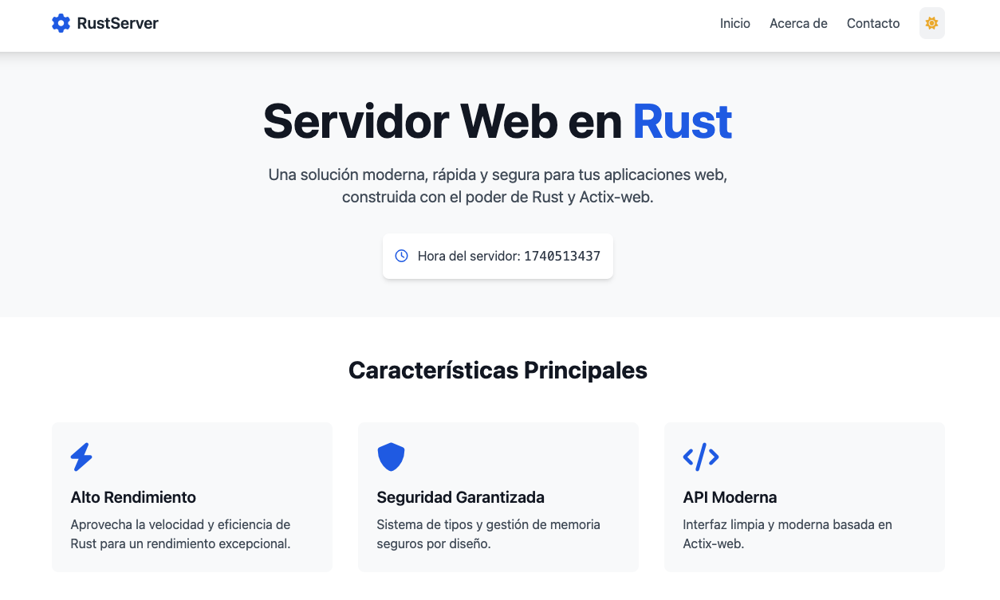
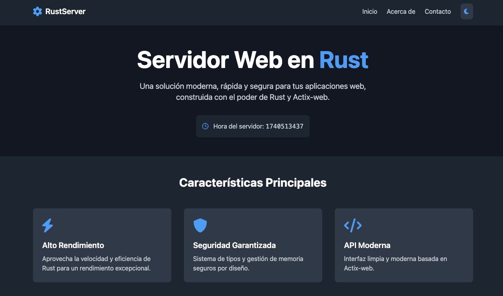

# Servidor Web en Rust

Un servidor web moderno y eficiente construido con Rust y Actix-web, que demuestra las capacidades de Rust para el desarrollo web. Este proyecto combina la potencia y seguridad de Rust en el backend con una interfaz de usuario moderna y adaptable.

## 🚀 Características

### Backend (Rust)
- ⚡ Alto rendimiento gracias al sistema de actores de Actix-web
- 🛡️ Seguridad garantizada por el sistema de tipos de Rust
- 🔄 Manejo eficiente de solicitudes concurrentes
- ⏰ Servidor de tiempo real para mostrar la hora del servidor
- 🎯 Zero-cost abstractions de Rust para máximo rendimiento

### Frontend
- 🎨 Diseño moderno y responsive con TailwindCSS
- 🌓 Toggle de tema claro/oscuro con persistencia
- 📱 Interfaz adaptativa para todos los dispositivos
- ⚡ Transiciones y animaciones suaves
- 🔍 Navegación intuitiva con scroll suave

## 🛠️ Tecnologías Utilizadas

### Backend
- **Rust** - Lenguaje de programación seguro y eficiente
- **Actix-web** - Framework web de alto rendimiento
- **Tera** - Motor de plantillas para Rust
- **Tokio** - Runtime asíncrono para Rust

### Frontend
- **TailwindCSS** - Framework CSS utilitario
- **FontAwesome** - Iconografía moderna
- **LocalStorage API** - Persistencia de preferencias de usuario
- **JavaScript** - Interactividad y gestión del tema

## 📋 Requisitos Previos
- Rust y Cargo instalados en tu sistema
- Navegador web moderno con JavaScript habilitado

## 🚀 Instalación

1. Clona el repositorio:
```bash
git clone https://github.com/mathiasmtt/webserver.git
cd webserver
```

2. Ejecuta el servidor:
```bash
cargo run --release
```

3. Abre tu navegador y visita:
```
http://localhost:8080
```

## 📁 Estructura del Proyecto
```
webserver/
├── src/
│   └── main.rs          # Código del servidor Rust
├── templates/
│   ├── base.html        # Template base con estructura común
│   ├── index.html       # Página de inicio
│   ├── about.html       # Página "Acerca de"
│   └── contact.html     # Página de contacto
├── static/              # Archivos estáticos
├── Cargo.toml           # Dependencias y configuración de Rust
└── README.md           # Documentación
```

## 📋 Actualizaciones Recientes

### Sistema de Múltiples Templates
Hemos implementado un sistema de templates que incluye:

- **Template Base**: Creamos un `base.html` que contiene la estructura común para todas las páginas, incluyendo:
  - Navegación con enlaces a todas las páginas
  - Footer consistente
  - Configuración de TailwindCSS
  - Sistema de cambio de tema (claro/oscuro)

- **Páginas Implementadas**:
  - **Inicio (`/`)**: Muestra la página principal con información del servidor y características
  - **Acerca de (`/about`)**: Información sobre el equipo y tecnologías utilizadas
  - **Contacto (`/contact`)**: Formulario de contacto e información de contacto

### Mejoras Técnicas
- Implementación de una instancia global de Tera para mejorar el rendimiento
- Manejo adecuado de errores en la renderización de templates
- Estructura de rutas clara y semántica
- Diseño responsive adaptado a todos los dispositivos

### Instrucciones de Uso
Para ejecutar el servidor:
```bash
# Compilar y ejecutar en modo desarrollo
cargo run

# Compilar y ejecutar en modo producción
cargo run --release
```

Una vez iniciado, el servidor estará disponible en: http://127.0.0.1:8080

### Próximos Pasos
- Implementación de un sistema de base de datos
- Agregar funcionalidad al formulario de contacto
- Implementar autenticación de usuarios

## 🎯 Características Detalladas

### Sistema de Navegación
- Navegación intuitiva entre las diferentes páginas
- Estructura de URL clara y semántica:
  - `/` - Página de inicio
  - `/about` - Página "Acerca de"
  - `/contact` - Página de contacto
- Diseño responsive adaptado a todos los dispositivos
- Menú de navegación consistente en todas las páginas

### Sistema de Temas
- Toggle intuitivo entre tema claro y oscuro
- Persistencia de preferencias usando LocalStorage
- Detección automática del tema del sistema
- Transiciones suaves entre temas
- Diseño consistente en ambos modos

### Sistema de Plantillas
- Uso de Tera como motor de plantillas para Rust
- Soporte para variables dinámicas como `{{ current_time }}`
- Carga eficiente de plantillas desde archivos
- Manejo de errores robusto para problemas de renderizado
- Separación clara entre lógica y presentación

### Solución de Problemas Comunes

#### Problemas con la Renderización de Plantillas
Si las plantillas no se renderizan correctamente, verifica:

1. **Rutas de archivos**: Asegúrate de que la estructura de directorios sea correcta:
   ```
   webserver/
   └── templates/
       └── index.html
   ```

2. **Carga de Plantillas**: El método recomendado es cargar plantillas específicas:
   ```rust
   // En lugar de usar patrones glob como "templates/**/*"
   tera.add_template_file("ruta/a/templates/index.html", Some("index.html"))
   ```

3. **Variables en Plantillas**: Verifica que todas las variables usadas en las plantillas
   estén definidas en el contexto:
   ```rust
   let mut context = Context::new();
   context.insert("current_time", &current_time.to_string());
   ```

4. **Logs de Depuración**: Habilita los mensajes de depuración para identificar problemas:
   ```rust
   println!("Ruta del template: {}", template_path_str);
   ```

### Arquitectura Backend
- Servidor web asíncrono de alto rendimiento
- Manejo eficiente de plantillas con Tera
- Rutas optimizadas para servir contenido estático
- Implementación thread-safe para concurrencia
- Gestión de estado del servidor en tiempo real

## 🤝 Contribución
Las contribuciones son bienvenidas. Por favor:
1. Haz fork del repositorio
2. Crea una rama para tu feature (`git checkout -b feature/AmazingFeature`)
3. Realiza commit de tus cambios (`git commit -m 'Add some AmazingFeature'`)
4. Push a la rama (`git push origin feature/AmazingFeature`)
5. Abre un Pull Request


## 📸 Algunas Imagenes de su aspecto

<div align="center">





*Servidor web en Rust con soporte para tema claro y oscuro*

</div>

## 📄 Licencia
Este proyecto está bajo la Licencia MIT.

## ✨ Autor
Mathias
